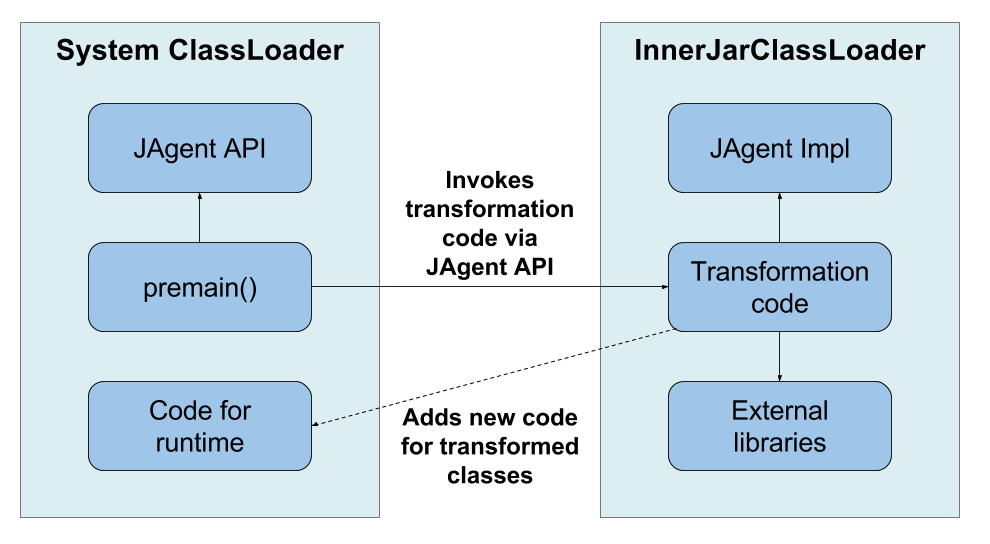

JAgent
======

[  ](https://bintray.com/devexperts/Maven/jagent/_latestVersion)

**JAgent** framework helps you to implement java agents. 
It has some extra functionality instead of standard Java's API. 

Class redefining
----------------
By default, java agents don't redefine already loaded classes.
Standard API has method
`java.lang.instrument.Instrumentation#redefineClasses(ClassDefinition... definitions)`
to redefine them. 
But it's impossible to redefine some classes (for example, `java.lang.String`) using this method.

**JAgent** has its own implementation of redefinition logic and allows to redefine all classes. 
But make careful with transforming classes from `java.*` package because of invalid transformation 
can cause strange errors into JVM code (segmentation fault, for example).

Class caching
-------------
This feature is under development. See `com.devexperts.jagent.CachingClassFileTransformer`.


FrameClassWriter
----------------
If you use ASM to code transformation then you can face a problem with frame counting. `ClassWriter` has a `getCommonSuperClass(String type1, String type2)` method to merge two types to compute stack frame attributes. If one of the types is the one being processed by this `ClassWriter` then you will catch `LinkageError` or `ClassCircularityError`. The cause of this problem is inside this method: `ClassWriter` uses `ClassLoader#forName(String type)` method to load class of specified type. **JAgent** has its own implementation of `getCommonSuperClass` method based on caching class metadata during transforming. So if you should find superclass of two types and one of them is the one being processed then you have information about it already and you don't need to load it again.

### Example: ###

```java
private final ClassInfoCache ciCache;

@Override
public byte[] transform(ClassLoader loader, String className, Class<?> clazz, ProtectionDomain pd, byte[] classfileBuffer) throws IllegalClassFormatException {
	ClassReader cr = new ClassReader(classfileBuffer);
	// this visitor exctracts information about class
	ClassInfoVisitor ciVisitor = new ClassInfoVisitor();
	cr.accept(ciVisitor, 0);
	// update cache with information about classes
	ciCache.getOrInitClassInfoMap(loader).put(className, ciVisitor.getClassInfo());
	// create FrameClassWriter using cache
	ClassWriter cw = new FrameClassWriter(loader, ciCache);
	...
	return cw.toByteArray();
}
```

Own classloader
---------------
**JAgent** has `InnerJarClassLoader` which is used to load transformation code and libraries via custom class loader.
What is it for?

If you have 2 agents that use library XXX with different versions then you have a version conflict. 
But it is all right if you load them under different class loaders. 
Use `InnerJarClassLoader` to load your transformation code and external libraries for it.

See scheme below to understand how to write java agents with this feature:


Fast logging
------------
Every `JAgent` instance has a `Log` object which is used to write logs efficiently.
You can use `JAgent#getLog()` method to get the `Log` object for your purposes.

Logs are written according to following format:
```
2016-02-10T02:48:19.902+0300 <agent_name>: <message>
```

Sample
======
You can find `sample` module in source code to see how to use **JAgent** for implementing your own java agent.

Maven
=====
Here is a guide how to create java agents via **JAgent** with *Maven*.

If you use `InnerJarClassLoader` then you should use 4 modules in your agent code:
* **core** - contains code that runs transformation and new code for runtime
* **transformer** - contains transformation logic
* **agent** - builds agent's jar, no code here
* **test** - tests for your agent

transformer module
-------------------
Contains code that is executable in transformation phase.
Should have `com.devexperts.jagent:jagent-impl` as dependency.
This code with dependencies is loaded under `InnerJarClassLoader`.

#### com.agent.package.YourJAgentImpl.java
Implementation of `JAgent` abstract class. This implementation is used in `com.agent.package.AgentRunner` code.

```java
public class YourJAgentImpl extends JAgent {

	private YourJAgentImpl(Instrumentation inst, String args, String agentName, String agentVersion, Log log) {
		super(inst, agentName, agentVersion, log);
	}
	
	public static YourJAgentImpl create(Instrumentation inst, String agentArgs) {
		String agentName = JAgentUtil.getImplTitle(YourJAgentImpl.class);
		String agentVersion = JAgentUtil.getImplVersion(YourJAgentImpl.class);
		Log log = new Log(agentName, Log.Level.DEBUG, null);
		YourJAgentImpl agent = new YourJAgentImpl(inst, agentArgs, agentName, agentVersion, log);
		agent.addTransformer(...);
		...
		return agent;
    }
}
```

#### *pom.xml* example:
Just contains needful dependencies for transformation.

```xml
 <dependencies>
     <dependency>
         <groupId>com.devexperts.jagent</groupId>
         <artifactId>jagent-impl</artifactId>
         <version>0.2</version>
     </dependency>
     <dependency>
         <groupId>org.ow2.asm</groupId>
         <artifactId>asm-all</artifactId>
         <version>5.0.4</version>
     </dependency>
</dependencies>
```

core module
----
Contains code that runs transformation and new code for runtime. 
All classes from this module will be available via system class loader.

#### MANIFEST.MF
Configures agent information and permissions.

```
Premain-Class: com.agent.package.AgentRunner
Can-Redefine-Class: true
Boot-Class-Path: ${agent.artifact.name}.jar

Name: com/agent/package
Implementation-Title: ${agent.artifact.name}
Implementation-Version: ${project.version}
Implementation-Vendor: <your company>
```

#### com.agent.package.AgentRunner.java
Runs transformation code via `JAgentRunner`.

```java
public class AgentRunner {
    public static void premain(String agentArgs, Instrumentation inst) throws Exception {
        JAgentRunner.runAgent("com.agent.package.YourJAgentImpl", inst, agentArgs,
                // All jars are located into your_agent.jar
                InnerJarClassLoader.createForJars("jagent-impl.jar", "transformer.jar", "asm-all.jar"));
    }
}
```

#### *pom.xml* example:
Builds jar with specified *MANIFEST.MF* and 
uses *maven-shade-plugin* to get rid of problems with different *jagent-api*'s versions in several java agents.

```xml
...
<build>
    <!-- Processes resources directory to replace Maven's variables to theirs values -->
    <resources>
        <resource>
            <directory>src/main/resources</directory>
            <filtering>true</filtering>
        </resource>
    </resources>
    <!-- Builds jar with specified MANIFEST.MF file-->
    <plugins>
        <plugin>
            <artifactId>maven-jar-plugin</artifactId>
            <configuration>
                <archive>
                    <addMavenDescriptor>false</addMavenDescriptor>
                </archive>
                <useDefaultManifestFile>true</useDefaultManifestFile>
            </configuration>
        </plugin>
        <!-- maven-shade-plugin is used for relocating "jagent-api" classes.
             It's necessary when you use "jagent-api" in several agents
             to get rid of conflict with different "jagent-api" versions. -->
        <plugin>
            <artifactId>maven-shade-plugin</artifactId>
            <executions>
                <execution>
                    <phase>package</phase>
                    <goals>
                        <goal>shade</goal>
                    </goals>
                    <configuration>
                        <artifactSet>
                            <includes>
                                <include>com.devexperts.jagent:jagent-api</include>
                            </includes>
                        </artifactSet>
                        <relocations>
                            <relocation>
                                <pattern>com.devexperts.jagent.api</pattern>
                                <shadedPattern>com.agent.package.shaded.com.devexperts.jagent.api</shadedPattern>
                            </relocation>
                        </relocations>
                    </configuration>
                </execution>
            </executions>
        </plugin>
    </plugins>
</build>

<dependencies>
    <dependency>
        <groupId>com.devexperts.jagent</groupId>
        <artifactId>jagent-api</artifactId>
        <version>0.2</version>
    </dependency>
</dependencies>
...
```

agent module
-----
This module contains only `pom.xml` to build `your_agent.jar`.

#### *pom.xml* example:
Unpacks `core` classes and adds *transformer*, *jagent-impl* and external libraries JARs to `your_agent.jar`. 
These JARs are loaded via `InnerJarClassLoader`.

```xml
<build>
    <!-- DO NOT RENAME because of "Boot-Class-Path" section in MANIFEST.MF -->
    <finalName>${agent.artifact.name}</finalName>
    <plugins>
        <!-- Firstly, maven-dependency-plugin unpacks "core" module
             and copies all other dependencies to its classpath.
             Classes from these dependencies will be loaded
             via InnerJarClassLoader from "core" module. -->
        <plugin>
            <artifactId>maven-dependency-plugin</artifactId>
            <executions>
                <execution>
                    <id>copy-dependencies</id>
                    <phase>prepare-package</phase>
                    <goals>
                        <goal>copy-dependencies</goal>
                    </goals>
                    <configuration>
                        <excludeArtifactIds>core,jagent-api</excludeArtifactIds>
                        <outputDirectory>${project.build.outputDirectory}</outputDirectory>
                        <stripVersion>true</stripVersion>
                    </configuration>
                </execution>
                <execution>
                    <id>unpack-dependencies</id>
                    <phase>prepare-package</phase>
                    <goals>
                        <goal>unpack-dependencies</goal>
                    </goals>
                    <configuration>
                        <includeArtifactIds>core</includeArtifactIds>
                        <outputDirectory>${project.build.outputDirectory}</outputDirectory>
                    </configuration>
                </execution>
            </executions>
        </plugin>
        <!-- Then, maven-jar-plugin builds jar with dependencies and
             specified MANIFEST.MF file (contains in "core" module). -->
        <plugin>
            <artifactId>maven-jar-plugin</artifactId>
            <configuration>
                <archive>
                    <addMavenDescriptor>false</addMavenDescriptor>
                </archive>
                <useDefaultManifestFile>true</useDefaultManifestFile>
            </configuration>
        </plugin>
    </plugins>
</build>

<dependencies>
    <dependency>
        <groupId>com.agent.package</groupId>
        <artifactId>core</artifactId>
        <version>${project.version}</version>
    </dependency>
    <dependency>
        <groupId>com.agent.package</groupId>
        <artifactId>transformer</artifactId>
        <version>${project.version}</version>
    </dependency>
</dependencies>
```

test module
----
Contains tests for your agent. Here is an example for unit testing.

#### *pom.xml* example:
Configures *maven-surefire-plugin* to run tests under yout agent.

```xml
...
<plugins>
    <!-- maven-dependency-plugin is used to copy your agent into target directory -->
    <plugin>
        <artifactId>maven-dependency-plugin</artifactId>
        <executions>
            <execution>
                <id>copy-sample-agent</id>
                <phase>process-test-classes</phase>
                <goals>
                    <goal>copy</goal>
                </goals>
                <configuration>
                    <artifactItems>
                        <artifactItem>
                            <groupId>com.agent.package</groupId>
                            <artifactId>your_agent</artifactId>
                            <version>${project.version}</version>
                            <outputDirectory>${project.build.directory}</outputDirectory>
                            <destFileName>${agent.artifact.name}.jar</destFileName>
                        </artifactItem>
                    </artifactItems>
                </configuration>
            </execution>
        </executions>
    </plugin>
    <!-- Configure maven-surefire-plugin to use your agent -->
    <plugin>
        <artifactId>maven-surefire-plugin</artifactId>
        <configuration>
            <argLine>-javaagent:${agent.directory}/${agent.artifact.name}.jar</argLine>
        </configuration>
    </plugin>
</plugins>
...
```


Getting support
===============
If you need help, you have a question, or you need further details on how to use **JAgent**, you can refer to the following resources:

* [dxlab](https://code.devexperts.com/display/DXLAB/dxLab+research) research group at Devexperts
* GitHub issues: [https://github.com/Devexperts/jagent/issues]()